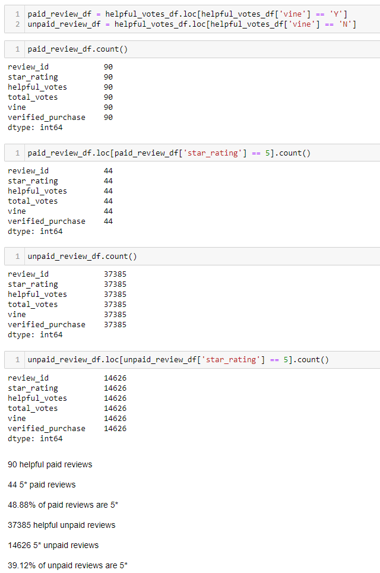

# Amazon Vine Analysis

## Overview

The purpose of this analysis was to determine whether product reviews from the Amazon Vine program are positively biased compared to unpaid reviews. This was accomplished by performing an ETL using PySpark and analyzing the resulting data using Pandas.

## Results

- 90 Vine reviews
    - 44 (48.88%) 5* Vine reviews
- 37,385 non-Vine reviews
    - 14,626 (39.12%) 5* non-Vine reviews
